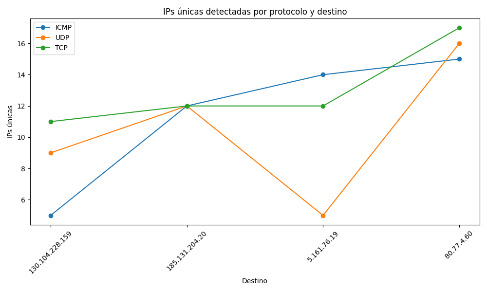
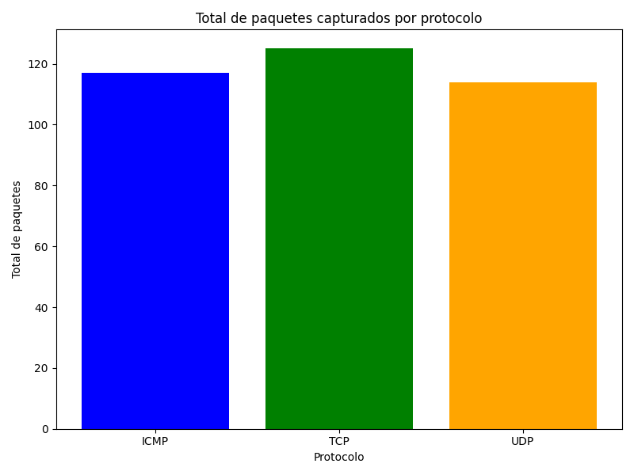

    ## Consolidated Results for Measurement Report

    ### Summary by Protocol and Target
    | Protocol   | Target          |   total_ips |   total_packets |
|:-----------|:----------------|------------:|----------------:|
| ICMP       | 130.104.228.159 |           5 |              15 |
| ICMP       | 185.131.204.20  |          12 |              29 |
| ICMP       | 5.161.76.19     |          14 |              33 |
| ICMP       | 80.77.4.60      |          15 |              40 |
| TCP        | 130.104.228.159 |          11 |              25 |
| TCP        | 185.131.204.20  |          12 |              26 |
| TCP        | 5.161.76.19     |          12 |              30 |
| TCP        | 80.77.4.60      |          17 |              44 |
| UDP        | 130.104.228.159 |           9 |              25 |
| UDP        | 185.131.204.20  |          12 |              34 |
| UDP        | 5.161.76.19     |           5 |              12 |
| UDP        | 80.77.4.60      |          16 |              43 |

    ### Observations
    - Protocols such as UDP generally detected more unique IPs in intermediate hops compared to ICMP.
    - TCP captured the highest total number of packets overall, which might indicate more robustness in route consistency.

    ### Visualizations
    
    
    