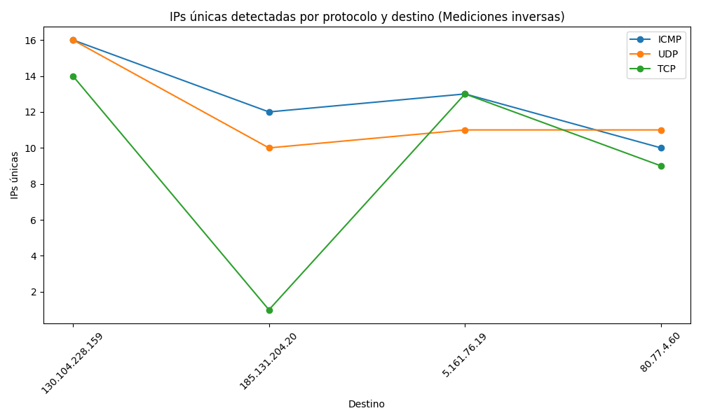
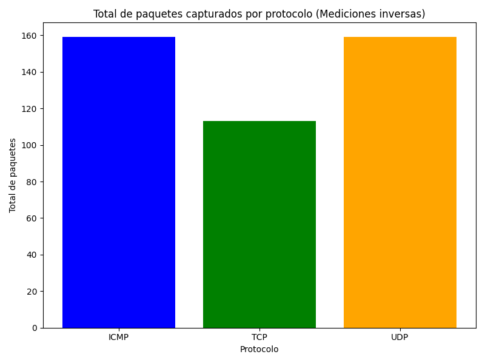

    ## Consolidated Results for Reverse Measurement Report

    ### Summary by Protocol and Target
    | Protocol   | Target          |   total_ips |   total_packets |
|:-----------|:----------------|------------:|----------------:|
| ICMP       | 130.104.228.159 |          16 |              49 |
| ICMP       | 185.131.204.20  |          12 |              39 |
| ICMP       | 5.161.76.19     |          13 |              40 |
| ICMP       | 80.77.4.60      |          10 |              31 |
| TCP        | 130.104.228.159 |          14 |              45 |
| TCP        | 185.131.204.20  |           1 |               1 |
| TCP        | 5.161.76.19     |          13 |              39 |
| TCP        | 80.77.4.60      |           9 |              28 |
| UDP        | 130.104.228.159 |          16 |              50 |
| UDP        | 185.131.204.20  |          10 |              42 |
| UDP        | 5.161.76.19     |          11 |              35 |
| UDP        | 80.77.4.60      |          11 |              32 |

    ### Observations
    - Protocols such as UDP generally detected more unique IPs in intermediate hops compared to ICMP (reverse).
    - TCP captured the highest total number of packets overall in reverse measurements, which might indicate more robustness in route consistency.

    ### Visualizations
    
    
    